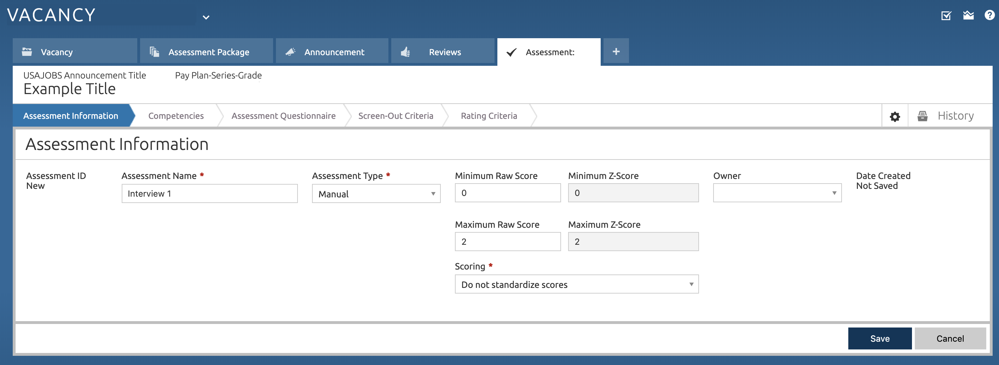

# Setting Up Manual Assessments in USA Staffing

In order for the SME-QA process to work, manual assessments must be set
up as part of the vacancy.

> If the Manual Assessments option isn't available to you, contact your USA Staffing Office Administrator.

> If the job analysis workshop found the need for the roles/parentheticals/specialties see the section on **specialties** set up first.

## Creating Manual Assessments

In order to create manual assessments, you must have an active
**vacancy**. You can create new manual assessments by creating new
assessments and selecting type **manual**. This will allow for manual
scoring which is critical for the SME-QA process.

Once this is done, un-check the **Rating** column from any assessments
that should be pass/fail _only_ and do not contribute to the final category rating (i.e. Resume review in the standard SME-QA process).

### Category Ratings

This process has used the following rating categories:

* Qualified - 70 points
* Well Qualified - 85 points
* Best Qualified - 100 points

The SME-QA process assumes that there is:

* One resume review without score (the resume review is pass/fail);
* and two interviews (both interviews are pass/fail and are used to determine category ratings) with the following details:
    * Passing score of 1
    * Maximum score of 2
    * Any applicant who does not meet the requirements will receive an ineligible NOR code and _no score_

Scores will then be transmuted as follows:

* Any applicant with two 1s receives 70 points.
* Any applicant with one 1 and one 2 receives 85 points.
* Any applicant with two 2s receives 100 points.

### SME-QA Standard Example

This assumes the standard SME-QA set up, using one *Resume Review* step and two *Interview* steps:
1. In the Vacancy's **Assessment Package** page, go to the **Assessment Plan** tab then create and name assessments of type **manual** for each stage:
    
    
    The specifics are as follows:
    1. *Resume Review*:
        - **Assessment Type**: Manual
        - **Minimum Raw Score**: 0
        - **Maximum Raw Score**: 1
        - **Scoring**: Do not standardize scores
        
    2. *Interview 1* and *Interview 2*:
        - **Assessment Type**: Manual
        - **Minimum Raw Score**: 1
        - **Maximum Raw Score**: 2
        - **Scoring**: Do not standardize scores
        
2. In the **Assessment Plan** tab, un-check the **Rating** column from
    the **Resume Review** assessment.
    
3. In the **Categories** tab, ensure you have the following categories:
    - *Best Qualified*: **Final Rating Cutpoint**: 100
    - *Well Qualified*: **Final Rating Cutpoint**: 85
    - *Qualified*: **Final Rating Cutpoint**: 70
    
4. Create the remainder of the vacancy as usual, excluding an occupational questionnaire.
5. For each participating SME, create a USA Staffing account.

> While the **Resume Review** will not have any scores, the USA Staffing system currently requires that you allow for a score of **0** or **1**.

Now that your system is set up, you can use the processes outlined in the USA Staffing Resume Review and Interview sections to get SME feedback.
