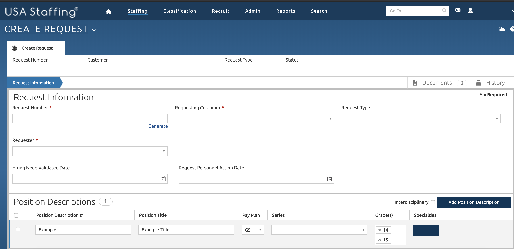
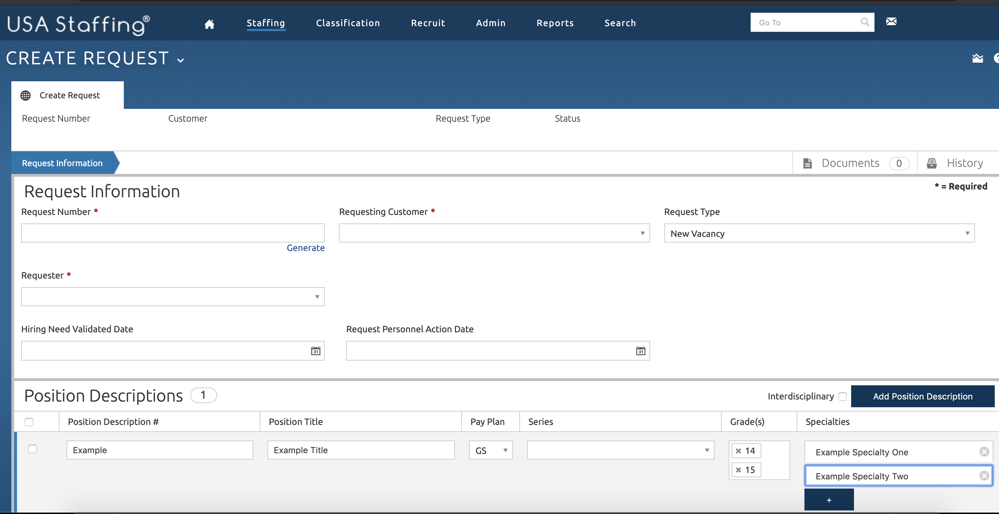
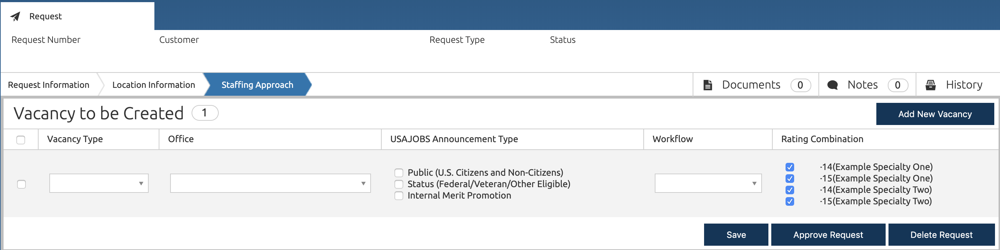
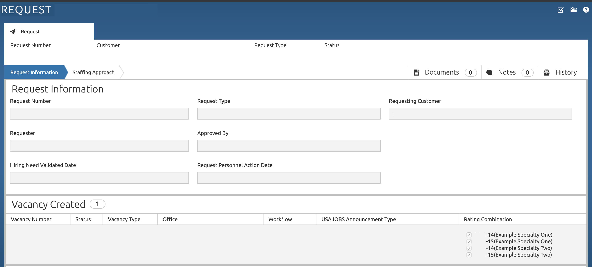
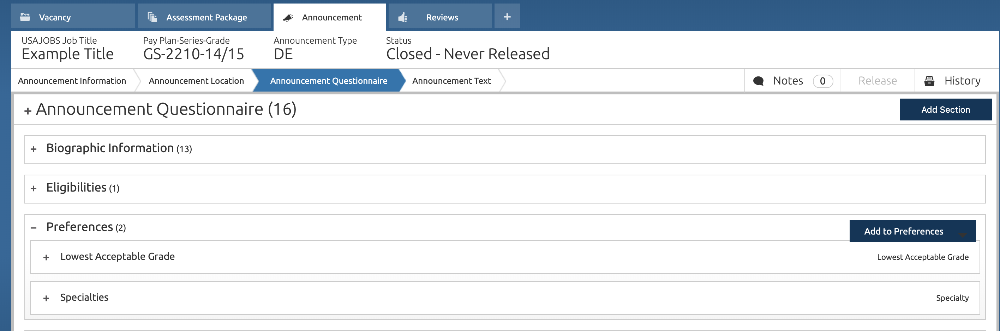
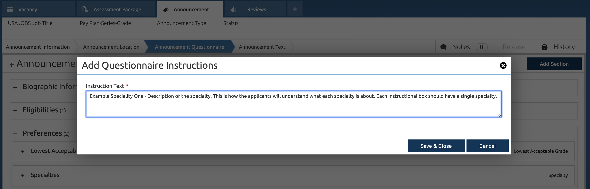
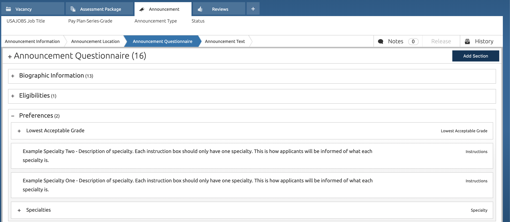

# Creating Parentheticals in USA Staffing

*For the purposes of this section roles and parentheticals will be treated the same, and will called parentheticals. The USAS feature that enables parentheticals is **specialties***.

When job analysis reveals multiple parentheticals that share core
competencies, but need evaluation for a specific role/parentheticals,
then it is recommended that you use the USA Staffing **Specialties**
feature.

> If job analysis did not reveal multiple roles/parentheticals, then you can skip this section and create the request _as you normally would_.

> It is a best practice is to limit the announcement to one position with multiple vacancies. Adding multiple parentheticals to an announcement adds significant complexity to the hiring process.

## Creating a Request

When creating a new **Request** in the **Position Description** section,
add each parenthetical to the **specialties** area:

After this is done, ensure the correct GS level, or levels, and
specialties will be available in the vacancy:

## Creating a Vacancy Announcement

When creating a new **Announcement** you must be sure each role is
accurately describe so applicants can select which roles and grade
levels they are interested in applying to:

1.  On the Announcement Questionnaire page, look for the **Preferences**
    
2.  From that page, hover over the **Add to Preferences** section and
    click **Instructions**.
    
3.  Type the name and description of one parenthetical/role option into
    the created **instructions** box.
    
4.  Repeat steps 2 and 3 for each parenthetical/role.
5.  Ensure that all the **instructions** boxes are all directly above
    the box labelled **Specialties**.
    

> If it's reasonable to imagine that an applicant would only be interested in 2 of 4 advertised roles, you can include instructions that say, _"You can select a total of 2 roles you are interested in. If you select more than 2, you will only be considered for the first two selected."_ If it's reasonable that an applicant would be interested in applying to all the roles, agencies should not try to limit their selection. Any selection limits will be manual since USA Staffing does not set selection limitations.

At the end of the process, USA Staffing will automatically generate
separate certificates for the specified parentheticals and will allow
different ratings for each parenthetical for each applicant. For
example, and applicant may be *Best Qualified* for *IT Specialist-
Generalist* but only *Well Qualified* for *IT Specialist-Policy and
Planning*.
